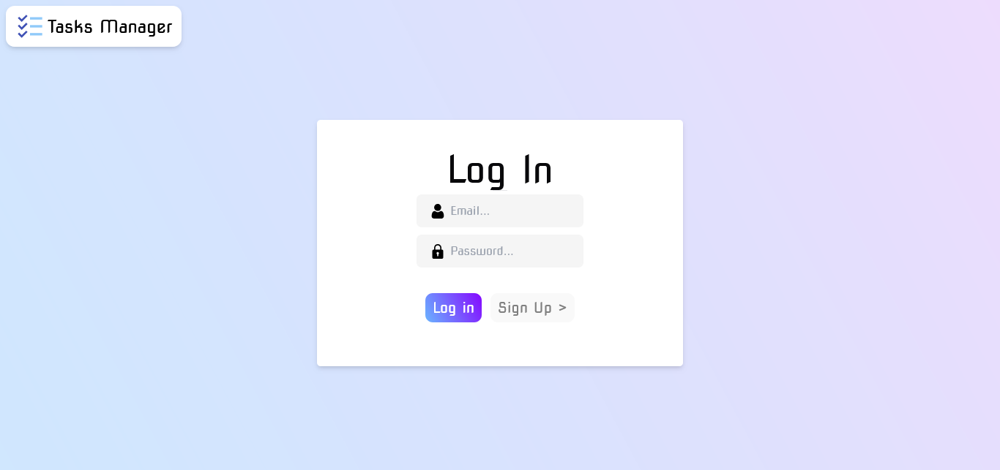
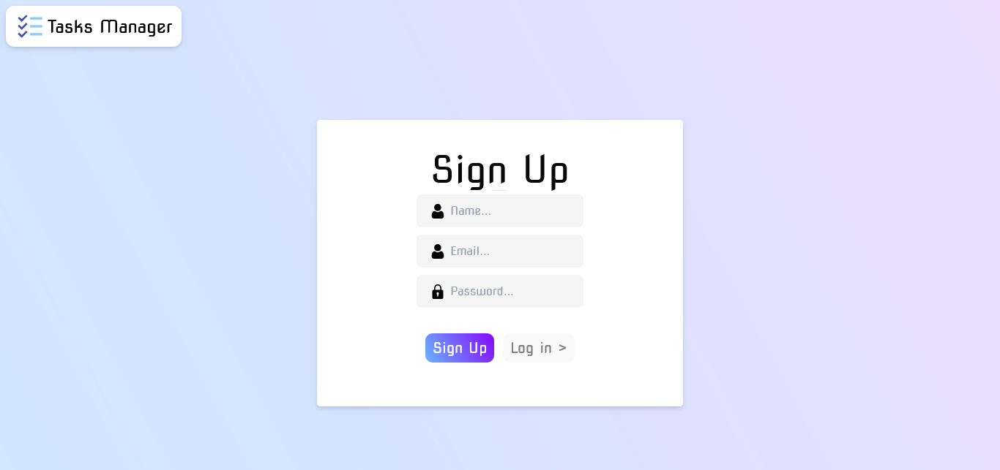
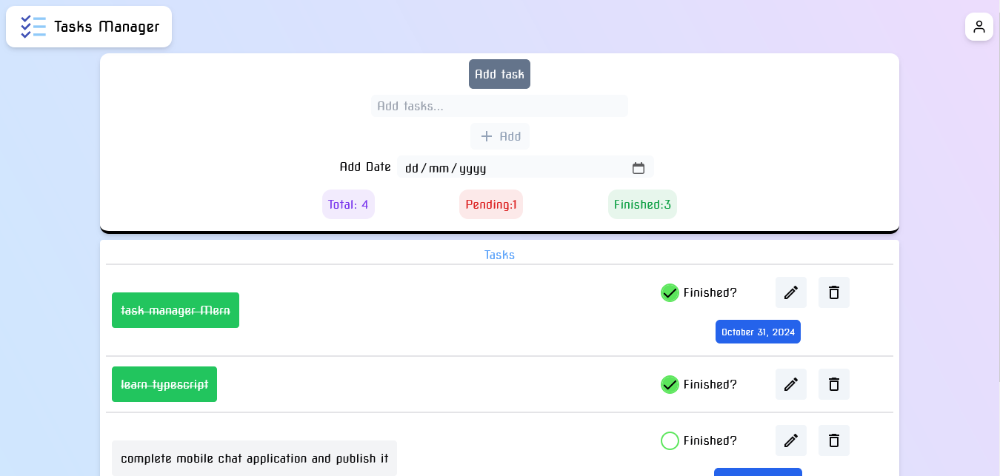

# Task Manager using MERN & typescript

This project is built by using-

# Frontend-
React with Typescript
axios
swal2
js-cookie
moment
react-custom-checkbox

# Backend-
Node js as js runtime
Mongodb as database
express
cors
jwt etc...

# Login Page-

# Signup Page-

# Home Page-

# How to run-

Setup .env file inside backend folder-
API_PORT = 5000

# database URI-
MONGO_URI = "your mongodb uri"

# JSON WEB TOKEN secret key min 32 letters-
JWT_secret_key = "anything_you_want_here_12345_krishkhare"

Open terminal 1
cd frontend
npm run dev

Open terminal 2
Start mongod process

Open terminal 3
cd backend
npm run dev
